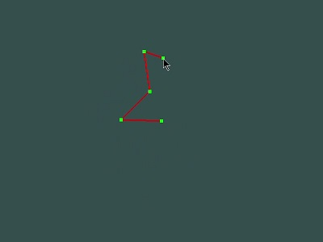
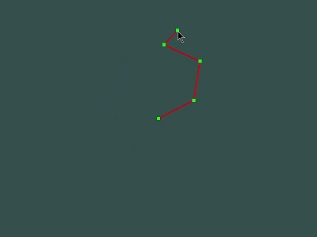
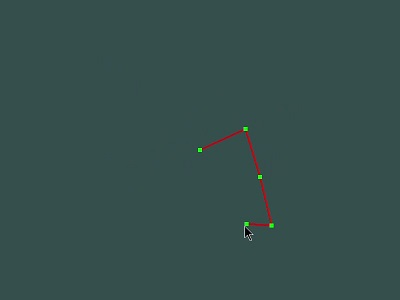
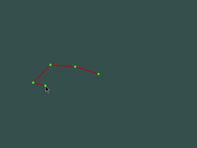
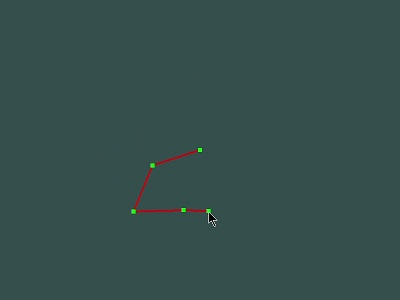
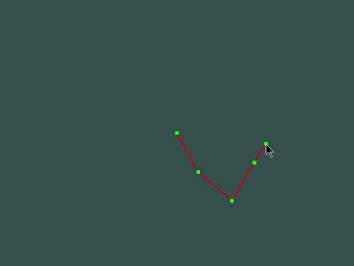
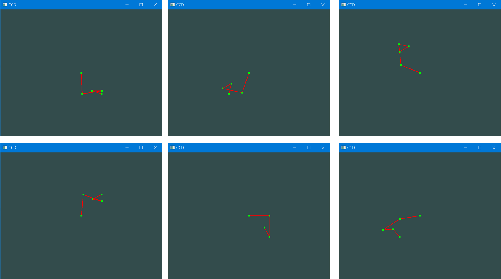
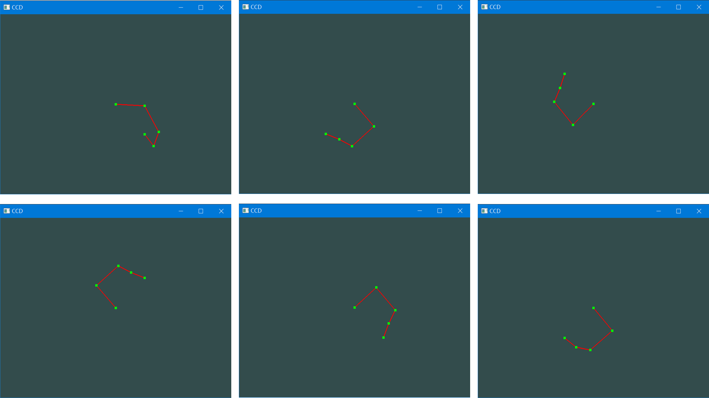

#### 循环坐标下降(CCD)算法实现程序说明
##### 编程环境
* 操作系统: Windows 10 x64
* IDE: CLion
* 编程语言: C++
* 第三方库: glfw, glad, glm

##### 程序说明
本程序实现了使用**循环坐标下降算法**(cyclic coordinate decent,CCD)求解逆向运动学问题。  
并且，对CCD算法进行优化，改变了算法中迭代调整的关节次序。实验表明，通过合理设置关节调整次序，可以使关节运动更加顺滑、自然，详细优化细节见[x]。
同时本程序支持限制关节的旋转角度。
###### CCD算法说明
假设运动肢体包含五个个关节，编号分别为A,B,C,D和E（A为根部关节，E为末端关节）。  
形如: (A)===(B)===(C)===(D)===(E)  
目标位置为T。
CCD算法如下:
1. 从末端关节E的父关节D开始，计算向量DE与向量DT的夹角，将关节(D)===(E)旋转使得DE与DT同向。
2. 若未达到目标位置T，用D的父关节C，计算CE和CT夹角，重复步骤1。
3. 若到对根节点A执行步骤1后依旧无法到达T，重复步骤1,2,3。直到到达目标位置T，或者达到最大迭代次数。

###### 算法优化说明
CCD算法描述可以简化为从末端关节开始，分别使用各关节点作为旋转中心点旋转关节，直到到达目标位置，旋转中心点的次序为D->C->B->A->D->C->B->...,各关节点选作中心点的次数相同。  
从人胳膊运动中可以发现，越靠近末端的关节运动越灵活，越靠近末端的关节被选作旋转中心的次数理应更多。因此对于该算法的改进中，将旋转中心点的选择次序修改为:D->C->D->B->C->D->A->B->C->D->...。  
当迭代到关节点X时，把X之后的关节再选择一次，这样增加了末端关节被选择的次数。实验表明对于某些运动情况，与传统CCD算法相比，使用改进后的CCD算法，下文中称该算法为**循环后缀关节坐标下降算法**(cyclic suffix joint coordinate decent,CJD）关节运动更加平滑、自然。
##### 运行说明
1. 程序运行说明：
* 可以选择直接双击运行./release文件夹下的"*.exe"文件，或使用命令```release.exe -i input.txt```运行./release文件夹下的可执行文件，其中```input.txt```为参数文件名，若未指定参数文件则使用默认参数。
* 或者使用CLion或者其他IDE打开源代码文件夹编译运行。

2. 参数文件说明  
   参数文件用来表明各个关节间的长度、各关节的旋转限制角度（旋转角度定义为关节与x正半轴的角度，范围为[-180,180]，默认关节旋转限制角度为[-180,180]）。  
   参数文件实例如下:
```
length:100 100 50 50
limit:-180 180
      -180 180
      -180 180
      -180 180
```
该参数文件表明包含五个关节，各关节间距分别为100,100,50,50，各关节可旋转的范围为[-180,180]。
如下：(A)=100=(B)=100=(C)=50=(D)=50=(E)

3. 运行说明
   程序运行后，移动鼠标，关节会以鼠标所在位置作为目标位置。按下SPACE键，切换使用CCD算法、CJD算法。

##### 程序运行结果
1. CCD算法运行截图:





2. CJD算法运行截图:





3. CCD与CJD运行对比:
   分别使用CCD算法和CJD算法让关节按照(100,100)->(100,-100)->(-100,-100)->(-100,100)运动，结果如下：

CCD算法结果:

从左到右，从上到下依次是(100,100)->(100,-100)->(-100,-100)->(-100,100)。

CJD算法结果:

从左到右，从上到下依次是(100,100)->(100,-100)->(-100,-100)->(-100,100)。

可以看到，使用CCD算法，在变换时会产生很明显的关节扭曲，末端关节变化大，没有规律、不自然。而使用CJD算法时关节在各个位置间过度时各关节相对位置、角度基本不变，只是以中心点为圆心旋转，相比CCD算法运动更为自然。